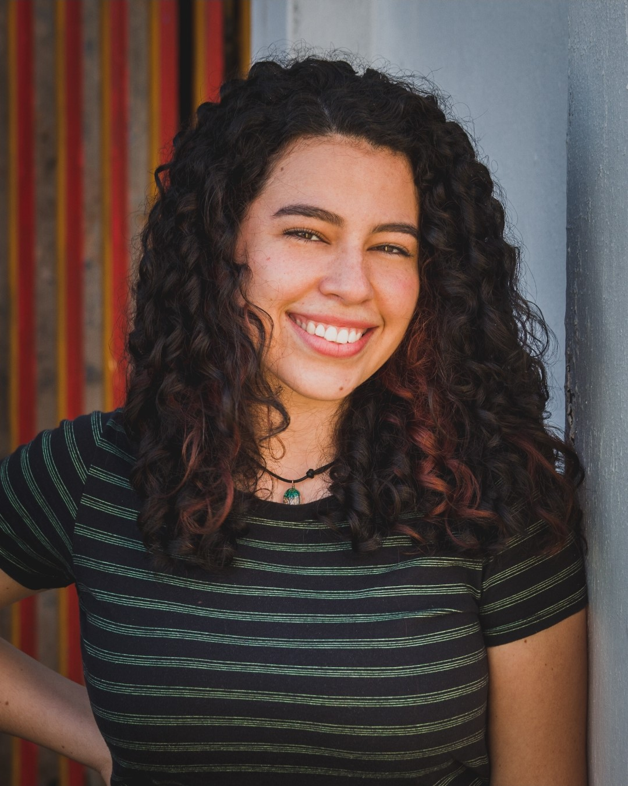

# .git.projeto.html
Projeto das aulas de HTML
<!DOCTYPE html>
<html lang="en">
<head>
    <meta charset="UTF-8">
    <meta http-equiv="X-UA-Compatible" content="IE=edge">
    <meta name="viewport" content="width=device-width, initial-scale=1.0">
    <title>Document</title>
</head>
<body>
    <h4>Bem Vindo</h4>
    <h2>Eu sou Angelica</h2>

    <figure>
        
    </figure>

    <h4 id="swamps">Acesso Rápido</h4>
       <ul id="my-list">
           <li>
               <a href="#swamps">Sobre mim</a>
           </li>
           <li>
               <a href="#swamps">Objetivos</a>
           </li>
           <li>
               <a href="#swamps">Hoobies</a>
           </li>
           <li>
               <a href="#swamps">Informações de Contato</a>
           </li>
       </ul>

       <h3>Sobre mim</h3>
       

        Meu nome é Angélica Sofia Nieves, tenho 19 anos, e sou Venezuelana. Morei na Venezuela até meus 17 anos, pois teve que sair por
        causa da crises que meu pais está passando. Nasci em Boa Vista – Roraima, Brasil, também
        sou brasileira. Atualmente moro em Lagoa Santa - Minas Gerais.
       

       <h3>Objetivos</h3>
       

        Minha visão futuramente, é ser profissional na área da tecnologia, pois, se trata da área que
        mais gosto e me sinto mais confortável. Sempre tive muita facilidade em mexer com
        computador e tratar com a tecnologia, e o meu desejo de querer aprender mais fez com
        que hoje a tecnologia seja o caminho que eu escolhi. O meu maior objetivo agora é fazer faculdade.
       

       <h3>Hoobies</h3>
       

           <ul>
               <li>Caminhar</li>
               <li>Leer</li>
               <li>Assistir documentarios</li>
               <li>Cozinhar</li>
           </ul>
       

       <h3>Informações de Contato</h3>
       <a>
        <a href="https://www.instagram.com/angelicaniev/">Instagram</a> 
       </a>
       
           
</body>
</html>
